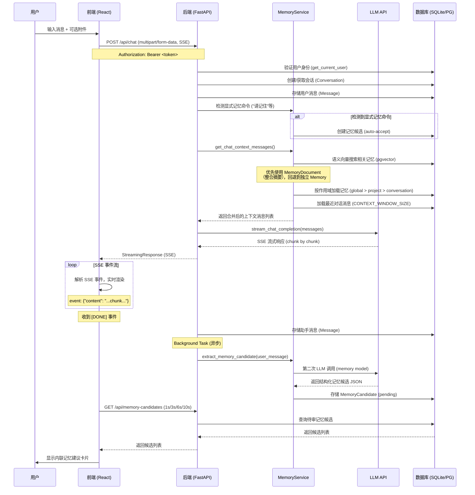
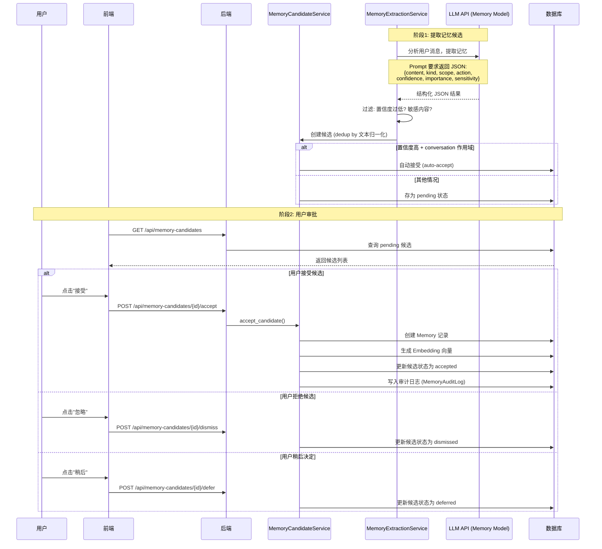
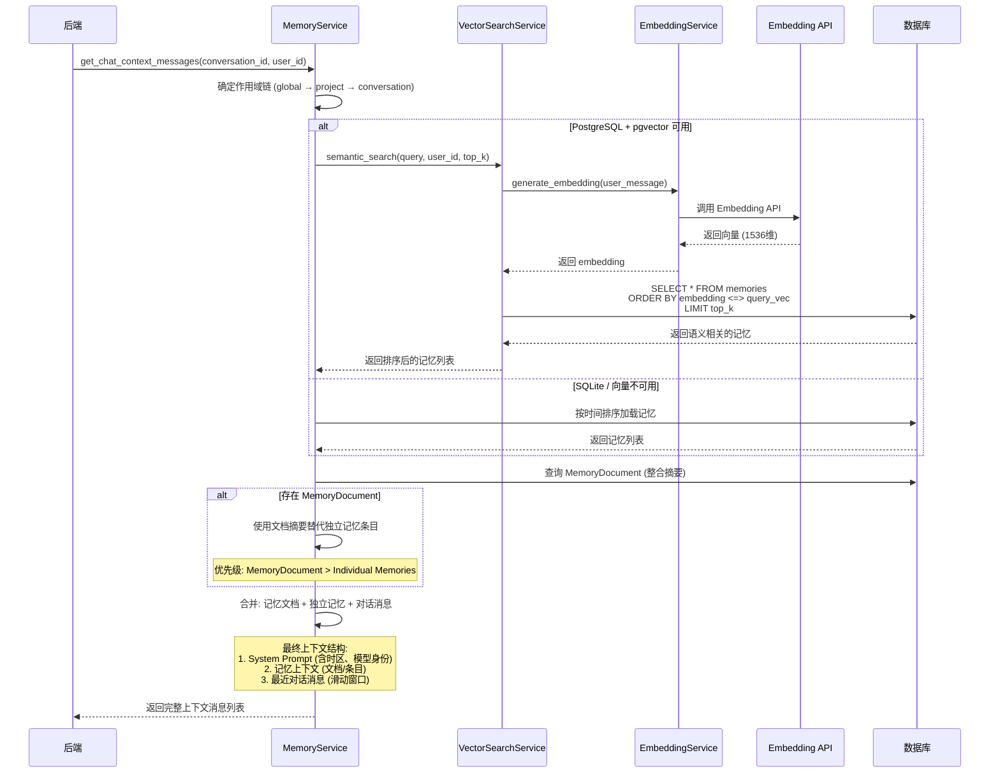
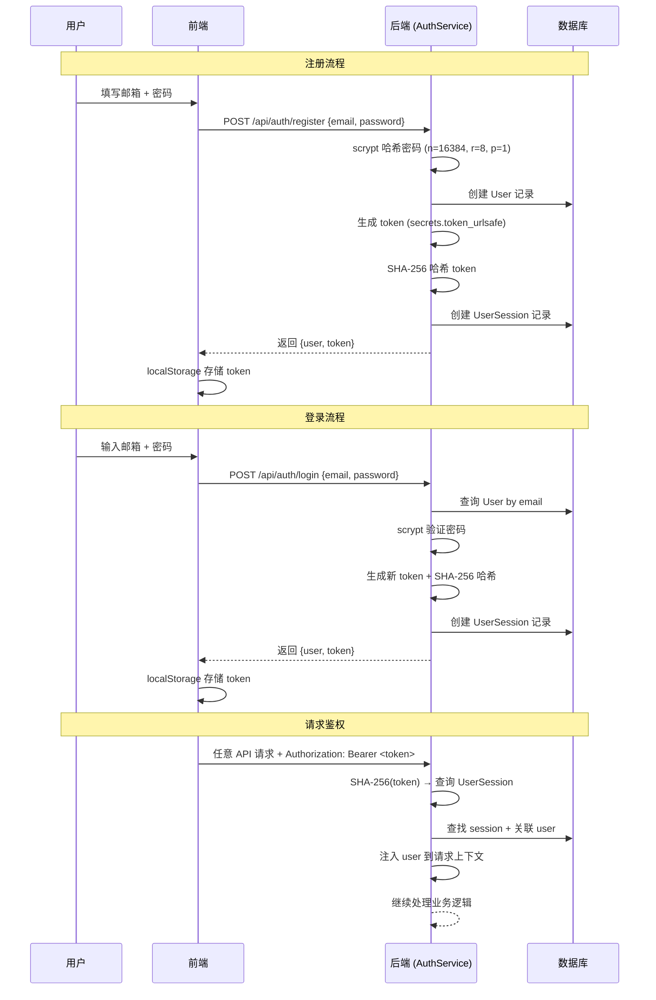
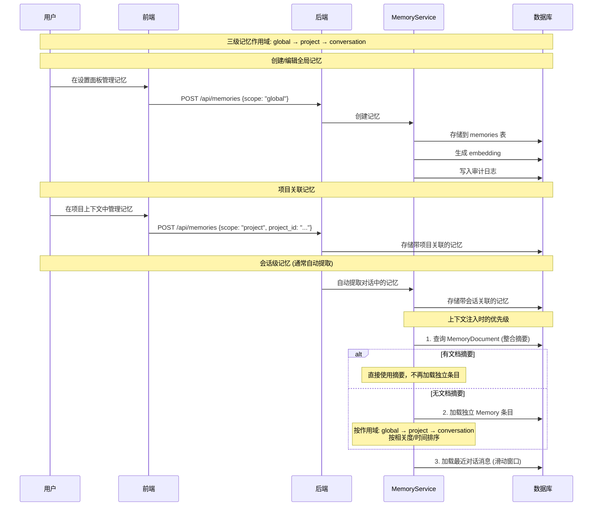
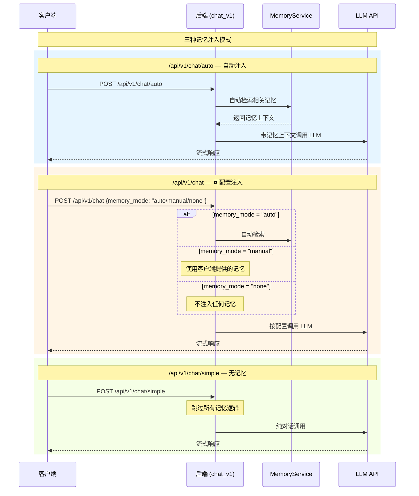
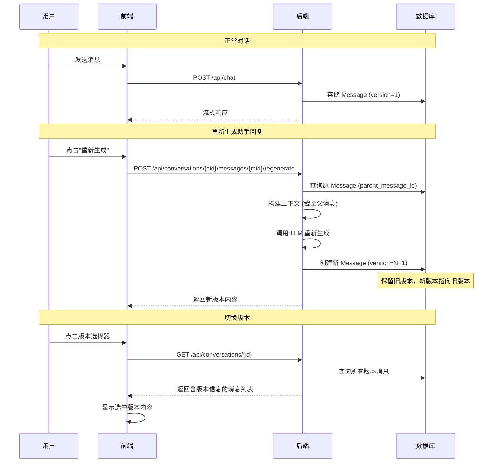

# LLM Memory Chat - 核心流程序列图

## 1. 用户聊天主流程（Chat Flow）

## 2. 记忆提取与审批流程（Memory Pipeline）

## 3. 记忆检索与注入流程（Memory Retrieval）

## 4. 认证流程（Authentication）

## 5. 记忆作用域与三级层次

## 6. V1 API 记忆注入模式

## 7. 消息版本管理（Message Versioning）

